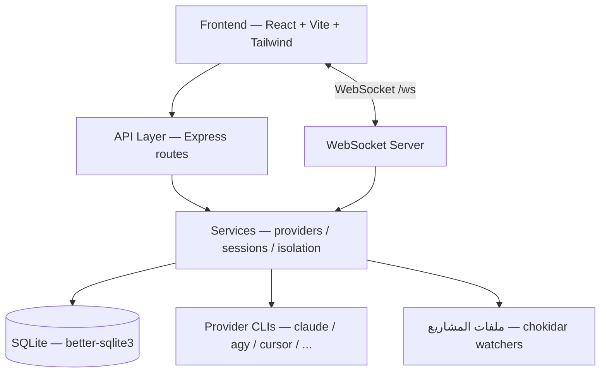
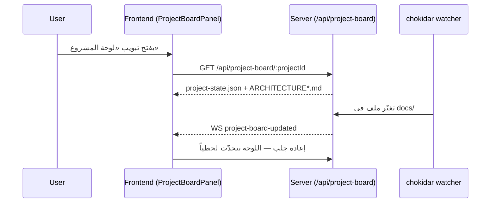
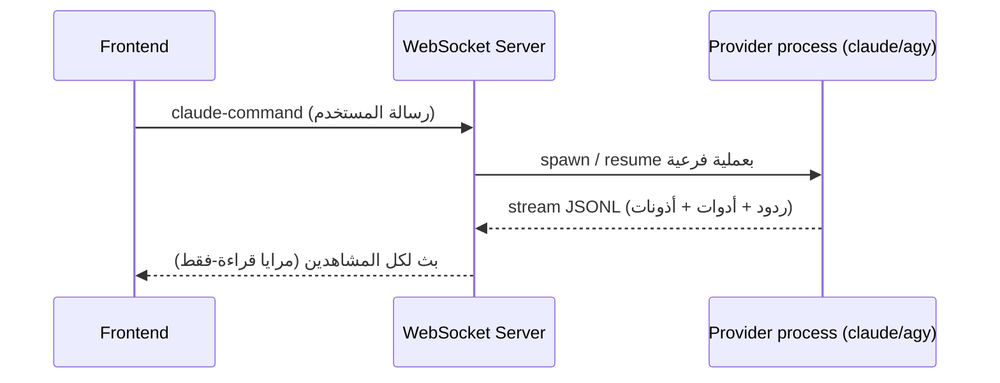

# الهيكلة التقنية — nassaj-dev

> **الجمهور:** الوكلاء وأي مطوّر. النسخة المبسطة للمالك: `ARCHITECTURE_AR.md` — **حدّثهما معاً** عند أي تغيير معماري.
> **آخر تحديث:** 2026-06-10

## نظرة عامة

fork من claudecodeui: واجهة ويب لإدارة جلسات وكلاء البرمجة (Claude Code، agy/Antigravity، Cursor، Codex، Gemini، OpenCode) مع دعم عربي/RTL كامل. Monolith واحد: سيرفر Express يقدّم واجهة React مبنية مسبقاً ويدير العمليات الفرعية للمزوّدين عبر WebSocket. يعمل تحت PM2 باسم `nassaj-dev` على المنفذ 3004 من `dist-server/` (build بـ tsc، لا تشغيل من المصدر).

## الطبقات



| الطبقة | المسار | المسؤولية | التقنية |
|---|---|---|---|
| Frontend | `src/` | الواجهة، i18n (9 لغات، RTL)، تبويبات المشروع (محادثة/ملفات/Shell/Git/لوحة المشروع) | React 18 + Vite + Tailwind |
| API | `server/routes/`، `server/modules/*/\*.routes.ts` | REST محمي بـ JWT: مشاريع، git، مزوّدون، لوحة المشروع | Express |
| WebSocket | `server/modules/websocket/` | بث الجلسات الحيّة، مرايا قراءة-فقط، إشعارات تغيّر الملفات | ws |
| Services | `server/services/`، `server/modules/providers/` | إدارة عمليات المزوّدين، عزل المستخدمين، drain عند الإيقاف | Node child processes |
| Data | `server/modules/database/` | مستخدمون/مشاريع/جلسات/مشاركون | SQLite |

## تدفق رئيسي: لوحة المشروع (قراءة حيّة بلا LLM)



## تدفق رئيسي: جلسة محادثة مع وكيل



## نقاط التكامل والتبعيات

- **CLIs المزوّدين** (`claude`, `agy`, `cursor-agent`, ...) — التنفيذ الفعلي للوكلاء — `server/modules/providers/` و`server/*-cli.js`.
- **PM2** — الإشراف على العملية مع `treekill:false` وdrain موقوت (ADR-021/022) — `ecosystem.config.cjs`.
- **TaskMaster** — التكامل موجود كوداً لكنه مُطفأ بالعلم `TASKMASTER_ENABLED=false` في `src/constants/features.ts` (تسهيلاً لمزامنة upstream).
- **mermaid** — يُحمَّل كسولاً في الواجهة لرسم مخططات وثائق الهيكلة.

## القرارات المعمارية

انظر `docs/decisions/` و`PROJECT_PLAN.md` § Decision Log.

---

# Providers & Vendor Models

> Scope of this section: the multi-provider model layer, with emphasis on the
> hosted vendor models (Kimi / DeepSeek / GLM) and Fable 5 added in ADR-036.
> This is an **internal, single-user** development tool (AGPL-3.0 fork of
> claudecodeui). See `docs/decisions/036-vendor-models-integration.md`.

## Provider layer

Every model integration is a provider under `server/modules/providers/list/<id>/`
exposing six facets (`server/shared/interfaces.ts`):

| Facet | Responsibility |
| --- | --- |
| `models` | Resolve the model catalog + active/selected model |
| `auth` | Report install/auth state |
| `mcp` | Read/list/write provider-native MCP config |
| `skills` | Discover provider-native skills |
| `sessions` | Normalize live events + fetch history |
| `sessionSynchronizer` | Index transcript artifacts into the DB |

`models`, `auth`, `sessions`, `sessionSynchronizer` are implemented concretely
(they depend on native SDK/CLI formats). `mcp`/`skills` inherit shared abstract
bases (`shared/mcp/mcp.provider.ts`, `shared/skills/skills.provider.ts`). The
Cursor provider is the reference; the new vendor providers follow it.

Providers are registered in `provider.registry.ts`, which makes them resolve via
`resolveProvider` and surface automatically in `/api/providers/:provider/models`
and `/auth/status`.

## Current providers

`claude`, `codex`, `cursor`, `gemini`, `antigravity`, `opencode`, and the three
hosted vendors `kimi`, `deepseek`, `glm`.

## Fable 5 (catalog-only)

`claude-fable-5` is an Anthropic model surfaced through the existing `claude`
provider's catalog (`CLAUDE_FALLBACK_MODELS`). The app drives Claude via the
Agent SDK (`query()`), which accepts the model string directly — there is no raw
Messages request to change. Fable travels the claude path and is therefore
covered by the iron-rule guard automatically.

## Hosted vendor models (Kimi / DeepSeek / GLM)

These are remote HTTP APIs (Moonshot, DeepSeek, Zhipu/Z.ai), not local CLIs.
They were added for internal single-user use; a vendor becomes usable the moment
its API key is configured (ADR-030 auth-status behavior), with no routing gate.

```
                 provider.registry.ts
                         │
   list/{kimi,deepseek,glm}/<id>.provider.ts  (Cursor pattern)
        │ models   │ auth        │ sessions / synchronizer   │ mcp/skills
        ▼          ▼             ▼                           ▼
 vendor-catalog  vendor-auth  vendor-sessions /          McpProvider /
 .client.ts      .provider.ts vendor-session-            SkillsProvider
 (live /v1/models, (key present  synchronizer.provider.ts (empty: no native
  breaker, SWR)    in store?)   (Anthropic events ↔        MCP/skill store)
                                 NormalizedMessage,
                                 JSONL transcript)

 RUN SEAM  (separate from the Claude path)
   server/{kimi,deepseek,glm}-cli.js
        │  spawn<Provider> / abort / isActive / getActive
        ▼
   shared/vendor/vendor-runtime.js
        - plain fetch → <baseUrl>/v1/messages (SSE)      ← NO @anthropic-ai SDK
        - key from resolveProviderEnv only               ← NO raw process.env
        - writes JSONL transcript + streams normalized events
        ▲
   index.js chat object → chat-websocket.service.ts dispatch (kimi/deepseek/glm)
```

### Iron rule (hard boundary)

The vendor run seam can never route a Claude client to a competitor:

- Base URLs are **hard-coded** in `shared/vendor/vendor-config.ts`, never read
  from `ANTHROPIC_BASE_URL`.
- The key is a provider-specific env var (`KIMI_API_KEY` / `DEEPSEEK_API_KEY` /
  `GLM_API_KEY`) injected by `resolveProviderEnv` — never `ANTHROPIC_AUTH_TOKEN`
  and never any `ANTHROPIC_*`/`CLAUDE_*` key.
- The seam uses plain `fetch` and imports neither `@anthropic-ai/*` nor
  `claude-sdk.js`.

Enforced by two tests (`node:test`):
`server/services/isolation/iron-rule-guard.test.ts` (static: no Anthropic-SDK
import, no `ANTHROPIC_*`/`CLAUDE_*` reference in the seam) and
`server/services/isolation/resolve-provider-env.test.ts` (positive: the produced
env carries the vendor key only, no Anthropic-namespace key).

### Per-user secret isolation

`server/services/isolation/provider-secrets-store.js` encrypts each user's vendor
keys at rest (AES-256-GCM; server key from `NASSAJ_PROVIDER_SECRETS_KEY` or an
auto-generated 0600 key file outside the repo) under
`~/.nassaj-users/<userId>/.provider-secrets/` (a shared home-root store in
single-user mode). `resolveProviderEnv` decrypts and injects per spawn. The three
vendors default to `'isolated'` in `provider-sharing.js`, so they never fall back
to a shared operator key.

## Claude engine on a vendor endpoint (ADR-037)

A second, distinct path (separate from the iron-rule-bound RUN seam above): the
**Claude engine itself** can run against a vendor's Anthropic-compatible endpoint
(`api.moonshot.ai/anthropic`, `api.deepseek.com/anthropic`, `api.z.ai/api/anthropic`)
by setting `ANTHROPIC_BASE_URL` + `ANTHROPIC_AUTH_TOKEN` on the spawn env. Because
that is the opposite of the iron rule's default posture, it is fenced so an
off-Anthropic base URL can never reach a spawn implicitly.

Modules (all in `server/services/isolation/`, intentionally **outside** the
ADR-036 `SEAM_FILES`):

- `provider-anthropic-endpoints.js` — `PROVIDER_ANTHROPIC_ENDPOINT`,
  `ENGINE_PROVIDERS`, `OFFICIAL_ANTHROPIC_HOSTS` (pure constants).
- `apply-claude-engine-provider-env.js` — `applyClaudeEngineProviderEnv(env,
  userId, provider)`: only for an engine provider **with** a stored per-user key,
  injects **both** base URL and token (never half-injects), **on the passed env
  only** (never `process.env`), and returns the authorized host `Set`.
- `anthropic-base-url-guard.js` — `assertAnthropicBaseUrlAllowed(env, ctx)`:
  fail-closed over every `*_BASE_URL` (env + settings.json values). Parses each
  URL (unparseable → reject) and requires the host to be official, OR this spawn's
  engine host (`ctx.engineProviderHosts`), OR the **escape hatch**
  (`CLAUDE_CODE_USE_BEDROCK`/`CLAUDE_CODE_USE_VERTEX` flags, or the
  `NASSAJ_ALLOWED_ANTHROPIC_HOSTS` env list) — else it throws.
- `collect-settings-base-urls.js` — reads the same `settings.json` `env` channel
  Claude Code reads at spawn and returns its `*_BASE_URL` values for the guard
  (degrades to `[]` on a missing/corrupt file).

Wired in `server/claude-sdk.js` after env/MCP are built and **before** `query()`
(apply → collect → assert); the no-hooks retry reuses the same `sdkOptions.env`,
so one guard covers every spawn path. The Claude model filter is bypassed only
when an engine provider was actually engaged.

The escape hatch keeps legitimate Bedrock/Vertex/proxy Claude Code setups working
(read from env, never hard-coded — the default install stays fail-closed).
Enforced by `server/services/isolation/claude-engine-provider.test.ts` and the
consolidated five-case isolation surface
`server/services/isolation/engine-provider-isolation.test.ts` (no process.env
leak; fail-closed on a foreign/unparseable `*_BASE_URL`; a settings.json-smuggled
base URL blocked via the collect→guard channel; no half-injection; per-user keys
never cross; and the per-spawn delegate uses each spawn's own user key).

### Vendor-delegate MCP (ADR-037, opt-in)

`server/modules/providers/shared/vendor/vendor-delegate-mcp.js` —
`buildVendorDelegateMcp(userId)` builds a **per-spawn** in-process MCP server
exposing `delegate_to_vendor`, letting a Claude run send a single prompt to a
vendor model without changing its own engine. The tool calls the vendor
`/v1/messages` as an independent `fetch` with `x-api-key`; it never touches
`ANTHROPIC_*`/`CLAUDE_*` or `sdkOptions.env`. Registered only when the agent's
"allow delegation" flag is set; the user id is captured in the tool closure (no
global instance) so the key is always per-user.

### Transcript & history

nassaj owns the vendor transcript (the remote API stores nothing locally): one
JSONL line per event under `~/.nassaj-vendor-sessions/<provider>/<projectHash>/`,
written by the run seam, indexed by the synchronizer, and replayed by
`fetchHistory`.

### Per-vendor compatibility

- **Kimi** — `tool_choice='required'` unsupported; temperature clamped to [0,1].
- **DeepSeek** — ~11% of tool calls can arrive as plain text; rescued into
  `tool_use` by the sessions facet.
- **GLM** — long streams can break mid-flight; per-event JSONL recording makes
  history correctness independent of stream length.

## Guardrails (internal-individual scope)

The real guardrails are: the iron rule, the encrypted per-user secret store, the
independent run seam (which also guarantees no Claude-output distillation), and a
new-dependency license check (no dependency was added — only Node built-ins and
existing modules). PDPL/DPA/data-residency/external-legal gates do not apply to
internal single-user use on the operator's own data.
