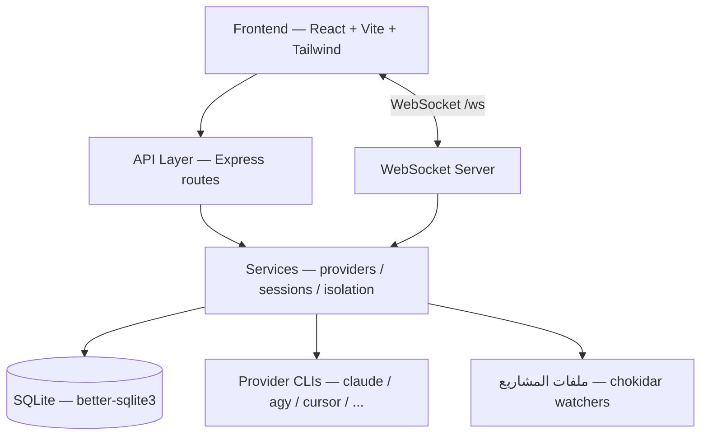
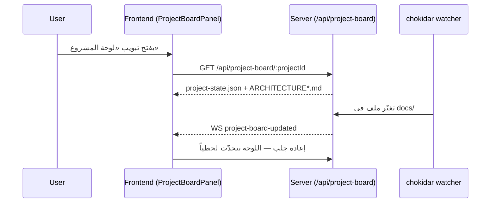
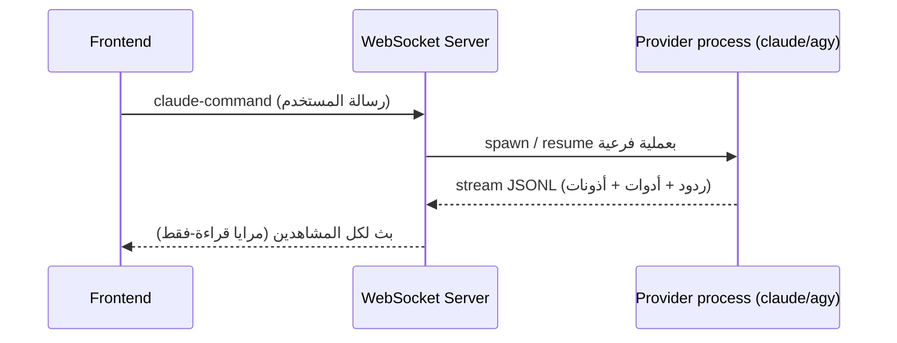

# الهيكلة التقنية — nassaj-dev

> **الجمهور:** الوكلاء وأي مطوّر. النسخة المبسطة للمالك: `ARCHITECTURE_AR.md` — **حدّثهما معاً** عند أي تغيير معماري.
> **آخر تحديث:** 2026-06-10

## نظرة عامة

fork من claudecodeui: واجهة ويب لإدارة جلسات وكلاء البرمجة (Claude Code، agy/Antigravity، Cursor، Codex، Gemini، OpenCode) مع دعم عربي/RTL كامل. Monolith واحد: سيرفر Express يقدّم واجهة React مبنية مسبقاً ويدير العمليات الفرعية للمزوّدين عبر WebSocket. يعمل تحت PM2 باسم `nassaj-dev` على المنفذ 3004 من `dist-server/` (build بـ tsc، لا تشغيل من المصدر).

## الطبقات

| الطبقة | المسار | المسؤولية | التقنية |
|---|---|---|---|
| Frontend | `src/` | الواجهة، i18n (9 لغات، RTL)، تبويبات المشروع (محادثة/ملفات/Shell/Git/لوحة المشروع) | React 18 + Vite + Tailwind |
| API | `server/routes/`، `server/modules/*/\*.routes.ts` | REST محمي بـ JWT: مشاريع، git، مزوّدون، لوحة المشروع | Express |
| WebSocket | `server/modules/websocket/` | بث الجلسات الحيّة، مرايا قراءة-فقط، إشعارات تغيّر الملفات | ws |
| Services | `server/services/`، `server/modules/providers/` | إدارة عمليات المزوّدين، عزل المستخدمين، drain عند الإيقاف | Node child processes |
| Data | `server/modules/database/` | مستخدمون/مشاريع/جلسات/مشاركون | SQLite |

## تدفق رئيسي: لوحة المشروع (قراءة حيّة بلا LLM)

## تدفق رئيسي: جلسة محادثة مع وكيل

## نقاط التكامل والتبعيات

- **CLIs المزوّدين** (`claude`, `agy`, `cursor-agent`, ...) — التنفيذ الفعلي للوكلاء — `server/modules/providers/` و`server/*-cli.js`.
- **PM2** — الإشراف على العملية مع `treekill:false` وdrain موقوت (ADR-021/022) — `ecosystem.config.cjs`.
- **TaskMaster** — التكامل موجود كوداً لكنه مُطفأ بالعلم `TASKMASTER_ENABLED=false` في `src/constants/features.ts` (تسهيلاً لمزامنة upstream).
- **mermaid** — يُحمَّل كسولاً في الواجهة لرسم مخططات وثائق الهيكلة.

## القرارات المعمارية

انظر `docs/decisions/` و`PROJECT_PLAN.md` § Decision Log.
