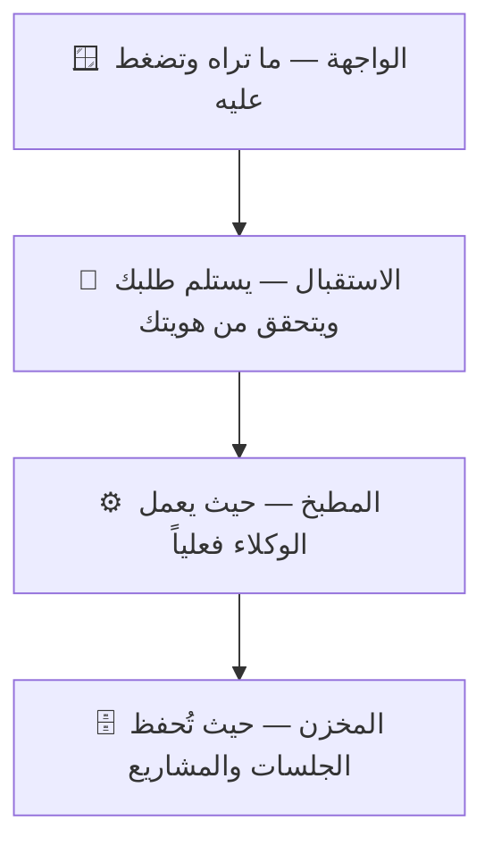

# هيكلة المشروع ببساطة — nassaj-dev

> **الجمهور:** مالك المنتج (غير تقني). النسخة التقنية: `ARCHITECTURE.md` — **حدّثهما معاً** عند أي تغيير معماري.
> **القاعدة هنا:** لغة يومية، تشبيهات، صفر مصطلحات بلا شرح.
> **آخر تحديث:** 2026-06-10

## ما هذا المشروع؟

موقع ويب تفتحه من المتصفح لتدير «الوكلاء الأذكياء» الذين يبرمجون لك (مثل Claude وagy): تكلّمهم، تراقب عملهم لحظة بلحظة، وتتصفح ملفات مشاريعك — كل ذلك بالعربية ومن أي جهاز.

## طبقات المشروع (تشبيه المبنى)

| الطبقة | بالعربي البسيط | مثال من المشروع |
|---|---|---|
| الواجهة | الصفحات والأزرار في المتصفح | تبويب المحادثة، لوحة المشروع |
| الاستقبال | بوّاب يتأكد أنك أنت ثم يمرر طلبك | تسجيل الدخول وكلمة المرور |
| المطبخ | غرفة العمل التي يشتغل فيها الوكلاء | عندما يكتب Claude كوداً لمشروعك |
| المخزن | أرشيف يحفظ كل محادثة ومشروع | عودتك لمحادثة الأمس كما تركتها |

## ماذا يحدث عندما تفتح «لوحة المشروع»؟

تضغط التبويب → الموقع يقرأ ملفات الحالة من مجلد المشروع نفسه (بلا أي ذكاء اصطناعي، صفر تكلفة) → ترى المراحل والمهام والأخطاء كما هي في الملفات → وإذا عدّل أحد الوكلاء الملف، تتحدّث اللوحة أمامك فوراً دون إعادة تحميل.

## ما الذي نعتمد عليه من خارج المشروع؟

- **أدوات الوكلاء (Claude، agy، وغيرها)** — هي «العمّال» الفعليون؛ موقعنا يديرهم ويعرض عملهم.
- **PM2** — حارس يبقي الموقع شغالاً دائماً ويعيد تشغيله بلطف دون قتل جلسات العمل الجارية.

## مصطلحات ستراها كثيراً

| المصطلح | معناه ببساطة |
|---|---|
| جلسة (Session) | محادثة واحدة مستمرة مع وكيل حول مهمة |
| مزوّد (Provider) | الجهة التي يأتي منها الوكيل: Claude أو agy أو غيرهما |
| لوحة المشروع | شاشة تلخص حالة المشروع من ملفاته مباشرة: المراحل والمهام والأخطاء |
| RTL | عرض الواجهة من اليمين لليسار كما تُكتب العربية |

---

# المزوّدون ونماذج المورّدين

> نطاق هذا المستند: طبقة النماذج متعددة المزوّدين، مع التركيز على نماذج المورّدين
> المستضافة (Kimi / DeepSeek / GLM) وFable 5 المضافة في ADR-036. هذه أداة تطوير
> **داخلية أحادية المستخدم** (فورك AGPL-3.0 من claudecodeui). انظر
> `docs/decisions/036-vendor-models-integration.md`.

## طبقة المزوّدين

كل تكامل نموذج هو مزوّد تحت `server/modules/providers/list/<id>/` يعرض ستة أوجه
(`server/shared/interfaces.ts`):

| الوجه | المسؤولية |
| --- | --- |
| `models` | حلّ كتالوج النماذج + النموذج الفعّال/المختار |
| `auth` | الإبلاغ عن حالة التثبيت/المصادقة |
| `mcp` | قراءة/سرد/كتابة إعداد MCP الأصلي للمزوّد |
| `skills` | اكتشاف مهارات المزوّد الأصلية |
| `sessions` | تطبيع الأحداث الحيّة + جلب التاريخ |
| `sessionSynchronizer` | فهرسة ملفّات الجلسات في قاعدة البيانات |

`models` و`auth` و`sessions` و`sessionSynchronizer` تُطبَّق concretely (تعتمد صيغ
الـSDK/CLI الأصلية). `mcp`/`skills` ترث أساسات مجرّدة مشتركة
(`shared/mcp/mcp.provider.ts` و`shared/skills/skills.provider.ts`). مزوّد Cursor هو
المرجع؛ مزوّدو المورّدين الجدد يتبعونه.

تُسجَّل المزوّدات في `provider.registry.ts`، فتُحلّ عبر `resolveProvider` وتظهر
آلياً في `/api/providers/:provider/models` و`/auth/status`.

## المزوّدون الحاليون

`claude` و`codex` و`cursor` و`gemini` و`antigravity` و`opencode`، والمورّدون
المستضافون الثلاثة `kimi` و`deepseek` و`glm`.

## Fable 5 (كتالوج فقط)

`claude-fable-5` نموذج Anthropic يظهر عبر كتالوج مزوّد `claude` القائم
(`CLAUDE_FALLBACK_MODELS`). التطبيق يقود Claude عبر Agent SDK (`query()`) الذي
يقبل معرّف النموذج مباشرةً — لا طلب Messages خام لتعديله. Fable يمرّ بمسار claude
فيشمله حارس القاعدة الحديدية آلياً.

## نماذج المورّدين المستضافة (Kimi / DeepSeek / GLM)

هذه واجهات HTTP بعيدة (Moonshot وDeepSeek وZhipu/Z.ai)، لا CLIs محلية. أُضيفت
للاستخدام الداخلي الفردي؛ يصبح المورّد فعّالاً لحظة تهيئة مفتاحه (سلوك auth-status
في ADR-030)، بلا بوابة توجيه.

### القاعدة الحديدية (حدّ صارم)

seam تشغيل المورّد لا يمكنه أبداً توجيه عميل Claude إلى منافس:

- عناوين القاعدة **ثابتة في الكود** في `shared/vendor/vendor-config.ts`، لا تُقرأ
  من `ANTHROPIC_BASE_URL`.
- المفتاح متغيّر بيئة خاص بالمزوّد (`KIMI_API_KEY` / `DEEPSEEK_API_KEY` /
  `GLM_API_KEY`) يحقنه `resolveProviderEnv` — لا `ANTHROPIC_AUTH_TOKEN` ولا أي
  مفتاح تحت namespace ‏`ANTHROPIC_*`/`CLAUDE_*`.
- الـseam يستخدم `fetch` خام ولا يستورد `@anthropic-ai/*` ولا `claude-sdk.js`.

يُفرض باختبارين (`node:test`):
`server/services/isolation/iron-rule-guard.test.ts` (ثابت: لا استيراد SDK أنثروبيك
ولا ذكر `ANTHROPIC_*`/`CLAUDE_*` في الـseam) و
`server/services/isolation/resolve-provider-env.test.ts` (موجب: البيئة الناتجة
تحمل مفتاح المورّد فقط، بلا مفتاح في namespace أنثروبيك).

### عزل الأسرار لكل مستخدم

`server/services/isolation/provider-secrets-store.js` يشفّر مفاتيح كل مستخدم عند
الراحة (AES-256-GCM؛ مفتاح الخادم من `NASSAJ_PROVIDER_SECRETS_KEY` أو ملف مفتاح
‏0600 مُولَّد خارج المستودع) تحت `~/.nassaj-users/<userId>/.provider-secrets/`
(مخزن مشترك على جذر الـhome في الوضع الأحادي). `resolveProviderEnv` يفكّ ويحقن لكل
spawn. المورّدون الثلاثة افتراضهم `'isolated'` في `provider-sharing.js`، فلا
يرتدّون أبداً إلى مفتاح مشغّل مشترك.

## محرّك Claude على واجهة مورّد (ADR-037)

مسار ثانٍ مستقل (منفصل عن seam التشغيل المحكوم بالقاعدة الحديدية أعلاه): يمكن تشغيل
**محرّك Claude نفسه** مقابل واجهة المورّد المتوافقة مع Anthropic
(`api.moonshot.ai/anthropic` و`api.deepseek.com/anthropic` و`api.z.ai/api/anthropic`)
بضبط `ANTHROPIC_BASE_URL` + `ANTHROPIC_AUTH_TOKEN` على بيئة الـspawn. ولأنّ ذلك عكس
الوضع الافتراضي للقاعدة الحديدية، فهو مُسيَّج بحيث لا يمكن أبداً أن يصل أي base URL
غير Anthropic إلى الـspawn ضمنياً.

الوحدات (كلها في `server/services/isolation/`، مقصودٌ إبقاؤها **خارج**
`SEAM_FILES` الخاص بـADR-036):

- `provider-anthropic-endpoints.js` — `PROVIDER_ANTHROPIC_ENDPOINT` و
  `ENGINE_PROVIDERS` و`OFFICIAL_ANTHROPIC_HOSTS` (ثوابت صرفة).
- `apply-claude-engine-provider-env.js` — `applyClaudeEngineProviderEnv(env,
  userId, provider)`: فقط لمزوّد محرّك **لديه** مفتاح مخزَّن لكل مستخدم، يحقن **كِلا**
  الـbase URL والـtoken (لا نصف-حقن)، **على الكائن env المُمرَّر فقط** (لا يلمس
  `process.env`)، ويعيد `Set` المضيف المسموح.
- `anthropic-base-url-guard.js` — `assertAnthropicBaseUrlAllowed(env, ctx)`:
  fail-closed على كل `*_BASE_URL` (قيم البيئة + settings.json). يحلّل كل URL (غير
  القابل للتحليل = رفض) ويشترط أن يكون المضيف رسمياً، أو مضيف محرّك هذا الـspawn
  (`ctx.engineProviderHosts`)، أو ضمن **escape hatch** (علَما
  `CLAUDE_CODE_USE_BEDROCK`/`CLAUDE_CODE_USE_VERTEX`، أو قائمة
  `NASSAJ_ALLOWED_ANTHROPIC_HOSTS` من البيئة) — وإلا رمى استثناءً.
- `collect-settings-base-urls.js` — يقرأ نفس قناة `settings.json` (`env`) التي
  يقرؤها Claude Code عند الـspawn ويعيد قيم `*_BASE_URL` للحارس (يتراجع إلى `[]` عند
  الغياب/الفساد).

مُدمَج في `server/claude-sdk.js` بعد بناء البيئة/الـMCP و**قبل** `query()`
(apply → collect → assert)؛ ومحاولة الإعادة بلا hooks تعيد استخدام نفس
`sdkOptions.env`، فحارس واحد يغطّي كل المسارات. ويُتجاوز فلتر نماذج Claude فقط عند
تفعيل مزوّد محرّك فعلياً.

الـescape hatch يُبقي إعدادات Claude Code المشروعة (Bedrock/Vertex/بروكسي) عاملةً
(يُقرأ من البيئة لا مثبَّتاً — والتنصيب الافتراضي يبقى fail-closed). يفرضه
`server/services/isolation/claude-engine-provider.test.ts` وسطح العزل المُجمَّع
بالحالات الخمس `server/services/isolation/engine-provider-isolation.test.ts` (لا
تسرّب لـprocess.env؛ رفض fail-closed لأي `*_BASE_URL` أجنبي أو غير قابل للتحليل؛
حجب BASE_URL مدسوس في settings.json عبر قناة collect→guard؛ منع نصف-الحقن؛ عدم
تقاطع مفاتيح المستخدمين؛ واستخدام كل spawn مفتاحَ مستخدمه في التفويض).

### MCP تفويض المورّد (ADR-037، اختياري)

`server/modules/providers/shared/vendor/vendor-delegate-mcp.js` —
`buildVendorDelegateMcp(userId)` يبني خادم MCP داخلي **لكل spawn** يعرض
`delegate_to_vendor`، يتيح لجلسة Claude إرسال موجَّه واحد إلى نموذج مورّد دون تغيير
محرّكها. تستدعي الأداة `/v1/messages` للمورّد عبر `fetch` مستقل بترويسة `x-api-key`؛
ولا تلمس `ANTHROPIC_*`/`CLAUDE_*` ولا `sdkOptions.env`. تُسجَّل فقط عند تفعيل علم
«السماح بالتفويض» للوكيل؛ ومُعرّف المستخدم مُلتقَط في closure الأداة (لا نسخة عالمية)
فيبقى المفتاح لكل مستخدم.

### النصوص والتاريخ

نسّاج يملك نص جلسة المورّد (الواجهة البعيدة لا تخزّن محلياً): سطر JSONL واحد لكل
حدث تحت `~/.nassaj-vendor-sessions/<provider>/<projectHash>/`، يكتبه seam التشغيل،
ويفهرسه المُزامن، ويعيد تشغيله `fetchHistory`.

### توافق كل مورّد

- **Kimi** — `tool_choice='required'` غير مدعوم؛ الحرارة محصورة في [0,1].
- **DeepSeek** — نحو 11% من استدعاءات الأدوات قد تأتي نصّاً؛ تُنقذ إلى `tool_use`
  في وجه sessions.
- **GLM** — البث الطويل قد ينكسر منتصفه؛ التسجيل بـJSONL لكل حدث يجعل صحّة التاريخ
  مستقلّة عن طول البث.

## الحواجز (النطاق الداخلي الفردي)

الحواجز الحقيقية: القاعدة الحديدية، ومخزن الأسرار المشفّر لكل مستخدم، وseam
التشغيل المستقل (الذي يضمن أيضاً عدم تقطير مخرجات Claude)، وفحص ترخيص أي تبعية
جديدة (لم تُضَف تبعية — أدوات Node المدمجة والوحدات القائمة فقط). بوابات
PDPL/DPA/data-residency/المراجعة القانونية الخارجية لا تنطبق على الاستخدام الداخلي
الفردي على بيانات المالك نفسه.
