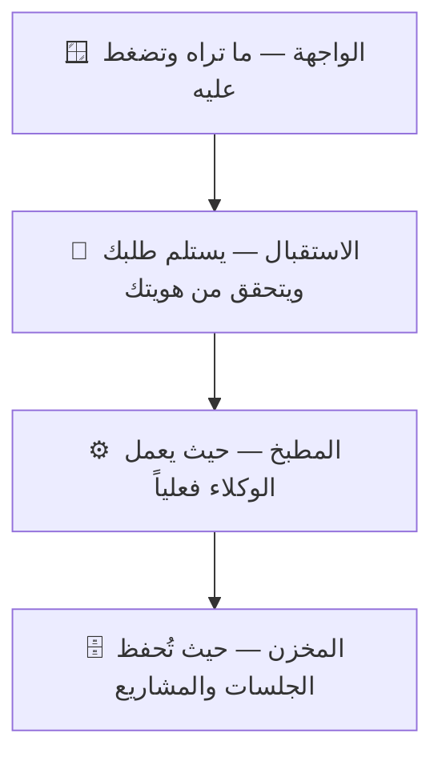

# هيكلة المشروع ببساطة — nassaj-dev

> **الجمهور:** مالك المنتج (غير تقني). النسخة التقنية: `ARCHITECTURE.md` — **حدّثهما معاً** عند أي تغيير معماري.
> **القاعدة هنا:** لغة يومية، تشبيهات، صفر مصطلحات بلا شرح.
> **آخر تحديث:** 2026-06-10

## ما هذا المشروع؟

موقع ويب تفتحه من المتصفح لتدير «الوكلاء الأذكياء» الذين يبرمجون لك (مثل Claude وagy): تكلّمهم، تراقب عملهم لحظة بلحظة، وتتصفح ملفات مشاريعك — كل ذلك بالعربية ومن أي جهاز.

## طبقات المشروع (تشبيه المبنى)

| الطبقة | بالعربي البسيط | مثال من المشروع |
|---|---|---|
| الواجهة | الصفحات والأزرار في المتصفح | تبويب المحادثة، لوحة المشروع |
| الاستقبال | بوّاب يتأكد أنك أنت ثم يمرر طلبك | تسجيل الدخول وكلمة المرور |
| المطبخ | غرفة العمل التي يشتغل فيها الوكلاء | عندما يكتب Claude كوداً لمشروعك |
| المخزن | أرشيف يحفظ كل محادثة ومشروع | عودتك لمحادثة الأمس كما تركتها |

## ماذا يحدث عندما تفتح «لوحة المشروع»؟

تضغط التبويب → الموقع يقرأ ملفات الحالة من مجلد المشروع نفسه (بلا أي ذكاء اصطناعي، صفر تكلفة) → ترى المراحل والمهام والأخطاء كما هي في الملفات → وإذا عدّل أحد الوكلاء الملف، تتحدّث اللوحة أمامك فوراً دون إعادة تحميل.

## ما الذي نعتمد عليه من خارج المشروع؟

- **أدوات الوكلاء (Claude، agy، وغيرها)** — هي «العمّال» الفعليون؛ موقعنا يديرهم ويعرض عملهم.
- **PM2** — حارس يبقي الموقع شغالاً دائماً ويعيد تشغيله بلطف دون قتل جلسات العمل الجارية.

## مصطلحات ستراها كثيراً

| المصطلح | معناه ببساطة |
|---|---|
| جلسة (Session) | محادثة واحدة مستمرة مع وكيل حول مهمة |
| مزوّد (Provider) | الجهة التي يأتي منها الوكيل: Claude أو agy أو غيرهما |
| لوحة المشروع | شاشة تلخص حالة المشروع من ملفاته مباشرة: المراحل والمهام والأخطاء |
| RTL | عرض الواجهة من اليمين لليسار كما تُكتب العربية |
