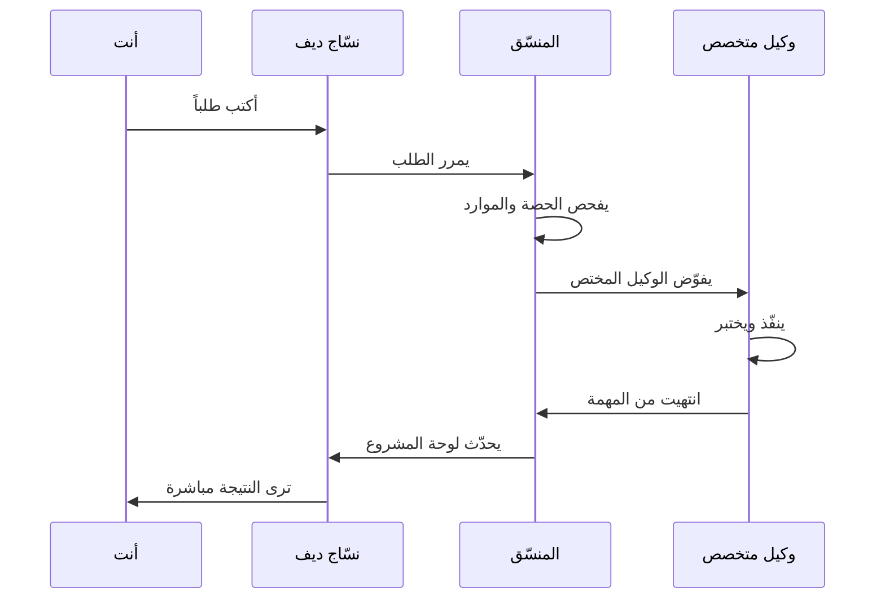

# صورة نسّاج الكبيرة

أهلاً بك. نسّاج منظومة عمل تُساعد الفريق على إنجاز المشاريع بكفاءة. دعنا نفهم الصورة الكبيرة قبل الدخول للتفاصيل.

## الهيكل الكامل

منظومة نسّاج تعيش داخل الكِندِي كوحدة داخلية خالصة.

### نسّاج — أداة داخلية

أداة ذكاء اصطناعي داخلية **لا تُباع ولا تُسوّق ولا تظهر للعملاء**. تخدم الفريق الداخلي فقط. مثل مطبخ المطعم — الزبائن لا يرونها، لكنها ضرورية للعمل.

**نسّاج جزآن:**

- **نسّاج كور** — العقل: المنسّق والوكلاء والقواعد التنظيمية
- **نسّاج ديف** — الواجهة: الموقع الذي تفتحه بالمتصفح

## رحلة سريعة: ماذا يحدث عندما تكتب طلباً؟

## المصطلحات الأساسية الأربع

| المصطلح | معناه |
|---|---|
| **المشروع** | مجلد عمل (مثل nassaj-dev): فيه الملفات والكود والمهام |
| **الجلسة** | محادثة مستمرة واحدة مع وكيل حول مهمة محددة |
| **لوحة المشروع** | شاشة تلخص حالة المشروع: المراحل والمهام والأخطاء |
| **الوكيل** | متخصص واحد من فريق الأذكياء: مبرمج، مصمم، محلل، إلخ |

## خريطة وصول سريع

**تريد أن تعرف…** **؟ اقرأ…**

| السؤال | الصفحة |
|---|---|
| كيف يعمل نسّاج؟ من ينفّذ؟ ومن الوكلاء الـ22؟ | [نسّاج كور: القلب والقواعد](02-nassaj-core.md) |
| كيف أستخدم الموقع؟ أين أكتب الطلب؟ وأين لوحة المشروع؟ | [نسّاج ديف: الواجهة](03-nassaj-dev.md) |
| ماذا يحدث بعد أن أكتب طلباً؟ كم من الوقت يستغرق؟ | [كيف تجري المهمة من البداية للنهاية](04-how-work-flows.md) |
| سؤالي لم يُجب عليه؟ ابدأ هنا | [أسئلة شائعة](05-faq.md) |
| كلمات غريبة من الموقع؟ ابحث هنا | [المسرد](06-glossary.md) |
| كيف يعمل التنفيذ الذاتي الليلي (المنوال)؟ | [المنوال: المُنفِّذ الذاتي لمشاريع نسّاج](08-minwal.md) |

## كم من الوقت يستغرق فهم كل شيء؟

- **هذا الملف:** ٣ دقائق
- **الملفات الأساسية (نسّاج كور + الواجهة):** ١٠ دقائق
- **المهام والـ FAQ:** ٥ دقائق إضافية

**المجموع: ٢٠ دقيقة** كي تفهم المنظومة كاملة. أو اقفز للصفحة التي تحتاجها مباشرة من الجدول أعلاه.

---

**الترتيب الموصى به:** [نسّاج كور والقواعد](02-nassaj-core.md) ← [نسّاج ديف والواجهة](03-nassaj-dev.md) ← [المهام والعمل](04-how-work-flows.md).
