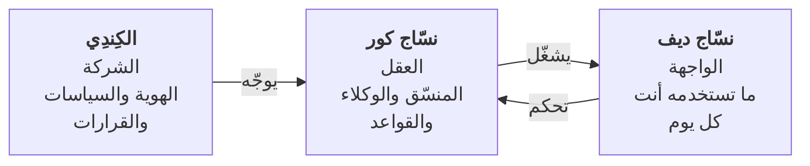
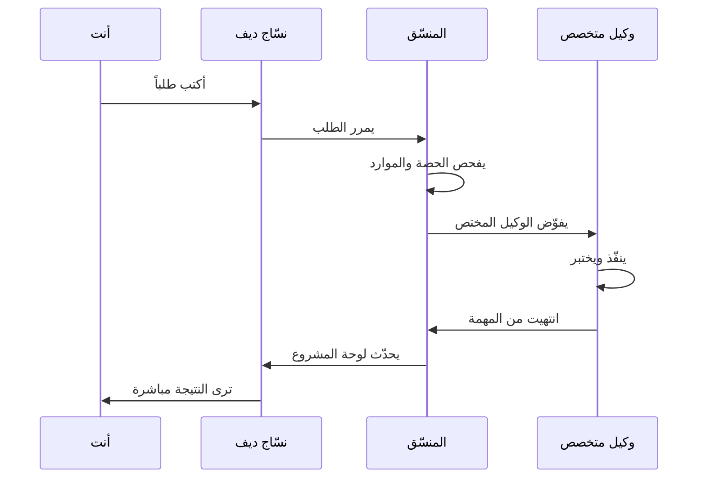

# صورة نسّاج الكبيرة

أهلاً بك. نسّاج منظومة عمل تُساعد الفريق على إنجاز المشاريع بكفاءة. دعنا نفهم الصورة الكبيرة قبل الدخول للتفاصيل.

## ثلاثة طبقات متكاملة

نسّاج مبني من ثلاثة أجزاء تعمل معاً بتناسق:

### ١. الكِندِي — الشركة
الإطار الكبير: شركة إبراهيم الرخيمي وسياساتها وقيمتها. كل قرار استراتيجي يأتي من هنا.

### ٢. نسّاج كور — العقل
القاعدة التقنية والقواعد التنظيمية. فيه وكلاء متخصصون (برامجون، مصممون، محللون)، ومنسّق يوزّع المهام عليهم ذكياً.

### ٣. نسّاج ديف — الواجهة
الموقع الذي تفتحه بالمتصفح على `nassaj-dev.alkindy.tech`. تراقب المشاريع، تكتب الطلبات، وترى لوحة المهام حية.

## رحلة سريعة: ماذا يحدث عندما تكتب طلباً؟

## المصطلحات الأساسية الأربع

| المصطلح | معناه |
|---|---|
| **المشروع** | مجلد عمل (مثل nassaj-dev): فيه الملفات والكود والمهام |
| **الجلسة** | محادثة مستمرة واحدة مع وكيل حول مهمة محددة |
| **لوحة المشروع** | شاشة تلخص حالة المشروع: المراحل والمهام والأخطاء |
| **الوكيل** | متخصص واحد من فريق الأذكياء: مبرمج، مصمم، محلل، إلخ |

## كم من الوقت يستغرق فهم كل شيء؟

- **هذا الملف:** ٥ دقائق
- **الملفات الثلاث التالية:** ١٠ دقائق
- **FAQ والمسرد:** ٣-٥ دقائق حسب احتياجك

**المجموع: ٢٠ دقيقة** كي تفهم المنظومة كاملة.

---

**الخطوة التالية:** اقرأ [الكِندِي والهوية](01-alkindy.md) ← [نسّاج كور والقواعد](02-nassaj-core.md) ← [نسّاج ديف والواجهة](03-nassaj-dev.md).
