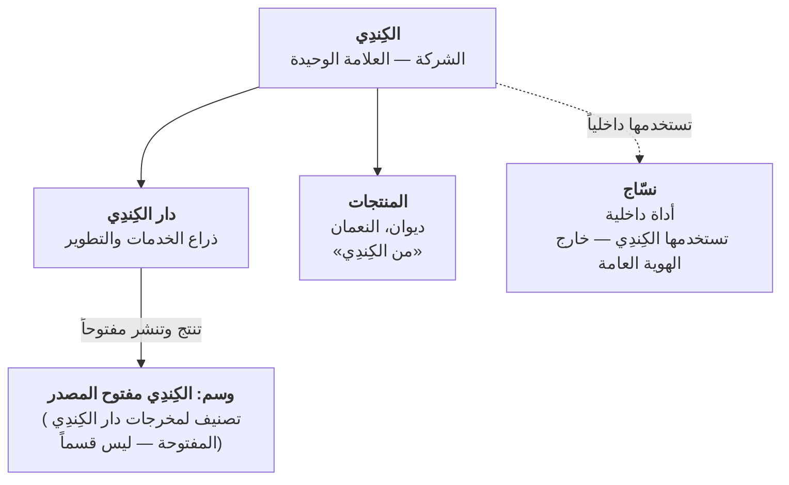
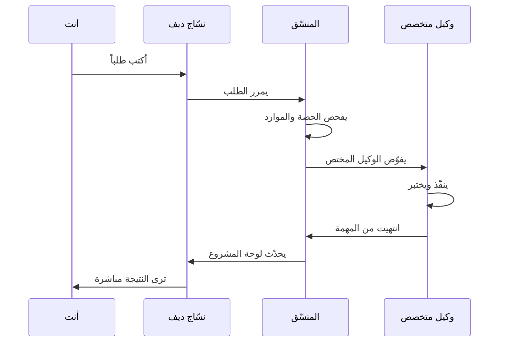

# صورة نسّاج الكبيرة

أهلاً بك. نسّاج منظومة عمل تُساعد الفريق على إنجاز المشاريع بكفاءة. دعنا نفهم الصورة الكبيرة قبل الدخول للتفاصيل.

## الهيكل الكامل

منظومة نسّاج تعيش داخل الكِندِي كوحدة داخلية خالصة، بينما دار الكِندِي هي الذراع التشغيلي الوحيد:

### ١. الكِندِي — الشركة والعلامة الوحيدة

الشركة الأم والهوية الموحّدة. جميع المنتجات والخدمات تُنسب للكِندِي مباشرة.

تحتها:
- **دار الكِندِي:** الخدمات الاستشارية والتطوير المخصص للعملاء — هذا هو الذراع التشغيلي الوحيد
- **وسم الكِندِي مفتوح المصدر:** تصنيف يُطبّق على مخرجات دار الكِندِي التي تُنشر مفتوحة المصدر (ليس قسماً منفصلاً)

### ٢. نسّاج — أداة داخلية

أداة ذكاء اصطناعي داخلية **لا تُباع ولا تُسوّق ولا تظهر للعملاء**. تخدم الفريق الداخلي فقط. مثل مطبخ المطعم — الزبائن لا يرونها، لكنها ضرورية للعمل.

**نسّاج جزآن:**

- **نسّاج كور** — العقل: المنسّق والوكلاء والقواعد التنظيمية
- **نسّاج ديف** — الواجهة: الموقع الذي تفتحه بالمتصفح

## رحلة سريعة: ماذا يحدث عندما تكتب طلباً؟

## المصطلحات الأساسية الأربع

| المصطلح | معناه |
|---|---|
| **المشروع** | مجلد عمل (مثل nassaj-dev): فيه الملفات والكود والمهام |
| **الجلسة** | محادثة مستمرة واحدة مع وكيل حول مهمة محددة |
| **لوحة المشروع** | شاشة تلخص حالة المشروع: المراحل والمهام والأخطاء |
| **الوكيل** | متخصص واحد من فريق الأذكياء: مبرمج، مصمم، محلل، إلخ |

## كم من الوقت يستغرق فهم كل شيء؟

- **هذا الملف:** ٥ دقائق
- **الملفات الثلاث التالية:** ١٠ دقائق
- **FAQ والمسرد:** ٣-٥ دقائق حسب احتياجك

**المجموع: ٢٠ دقيقة** كي تفهم المنظومة كاملة.

---

**الخطوة التالية:** اقرأ [الكِندِي والهوية](01-alkindy.md) ← [نسّاج كور والقواعد](02-nassaj-core.md) ← [نسّاج ديف والواجهة](03-nassaj-dev.md).
