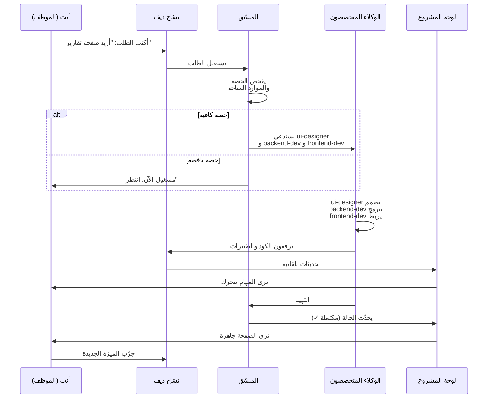

# كيف تجري المهمة من البداية للنهاية

دعنا نتتبّع مهمة واحدة من اللحظة التي تكتب فيها طلبك إلى اللحظة التي ترى فيها النتيجة.

---

## مثال واقعي: طلب ميزة جديدة

**السيناريو:** أنت تريد صفحة جديدة لتقارير التحليلات.

## الخطوات الكاملة



## شرح مرحلة بمرحلة

### ١. تكتب طلبك (دقيقة واحدة)

```
أنت: أريد صفحة تقارير تفصيلية تُظهر:
  - عدد المستخدمين الجدد هذا الأسبوع
  - الإيرادات اليومية
  - أكثر الميزات استخداماً
  أريدها بتصميم جميل ويمكن تصديرها PDF
```

**النقاط المهمة:**
- كن واضحاً في طلبك
- اذكر كل المتطلبات (ليس فقط الميزة، بل التفاصيل)
- لا تقل "افعل ما تراه صحيحاً" — قل بالضبط ماذا تريد

### ٢. المنسّق يفحص الحصة (ثوان)

المنسّق يسأل نفسه:
- هل عندي وكلاء متاحين؟
- هل عندي ساعات عمل متبقية اليوم؟
- هل الموارد كافية (خادم، ذاكرة، إلخ)؟

**الحالات الثلاث:**
1. **كل شيء متاح:** يستدعي الوكلاء فوراً
2. **وكلاء مشغولون:** يضع الطلب في الصف وينتظر
3. **حصة انتهت:** يقول لك "انتظر حتى تجدّد الحصة" (ساعات العمل الأسبوعية انتهت)

### ٣. المنسّق يستدعي الوكلاء المختصين (دقيقة)

لطلب التقارير، يستدعي ثلاثة:

| الوكيل | الدور | المهمة |
|---|---|---|
| **ui-designer** | المصمم | يرسم الصفحة: أين الأزرار، الرسوم البيانية، الألوان |
| **backend-dev** | مبرمج الخادم | يبرمج الـ APIs: جلب البيانات من قاعدة البيانات |
| **frontend-dev** | مبرمج الواجهة | يربط التصميم مع البيانات، يصنع الأزرار |

المنسّق يقول لكل واحد: "هذا طلبك، فيه السياق، شرح شامل، ومواعيد التسليم".

### ٤. الوكلاء ينفّذون (ساعات)

- **ui-designer:** يفتح Figma (أداة التصميم)، يرسم الصفحة، ينتهي بعد ساعة
- **backend-dev:** يكتب الـ APIs، ينتهي بعد ساعتين
- **frontend-dev:** ينتظر حتى ينتهي backend-dev، ثم يربط الكود، ينتهي بعد ساعة

كل واحد يختبر عمله. إذا كان هناك خطأ، يصلحه (لا ينتظر).

### ٥. التحديثات تظهر على اللوحة

لوحة المشروع **تنتعش حياً**:
- `backend-dev ينهي` → المهمة تتحول لأخضر (مكتملة)
- `frontend-dev ينهي` → الصفحة الكاملة تُعتبر جاهزة

**أنت ترى كل هذا وأنت تشرب قهوتك.** لا تحتاج لسؤال "كم اشتغلتوا؟" — اللوحة تخبّرك.

### ٦. الاختبار والمراجعة (دقائق)

قبل أن يقول المنسّق "انتهينا"، **qa-critic** (مختبر الجودة) يقول:
- هل الكود نظيف؟
- هل يُعمل على جميع الأجهزة؟
- هل آمن (لا هناك ثغرات أمان)؟
- هل سريع؟

إذا كل شيء تمام: يوافق. إذا فيه مشكلة: يقول "أصلح هذا".

### ٧. المنسّق يحدّث لوحة المشروع

عندما كل شيء جاهز:
- **الحالة:** من "قيد الإنجاز" إلى "مكتملة ✓"
- **التاريخ:** متى انتهينا بالضبط
- **ملاحظة:** ما الذي تم بالضبط

هذا يُوثّق كل شيء للمستقبل.

### ٨. النتيجة النهائية

الآن **الصفحة حية** على الموقع:
- تفتح `nassaj-dev.alkindy.tech`
- تضغط على "التقارير"
- ترى البيانات والرسوم البيانية جميلة

والمهمة انتهت.

## كم من الوقت؟

- **طلب بسيط** (تصحيح نص، إضافة زر): ١ ساعة
- **ميزة متوسطة** (صفحة جديدة): ٣-٥ ساعات
- **ميزة كبيرة** (نظام جديد كامل): أيام أو أسابيع

## ماذا تكتب في طلبك لكي يفهمك نسّاج؟

### الصيغة الذهبية

```
الموضوع: [اختر واحد من: ميزة / إصلاح خطأ / تحسين / توثيق]

الوصف:
- ما المشكلة أو الحاجة؟
- ماذا تريد بالضبط؟
- متى تحتاجها (اليوم، الأسبوع القادم، إلخ)؟

التفاصيل:
- أي بيانات أو أرقام أو أمثلة؟
- أي حدود أو قيود؟
- هل لديك تصميم أو فكرة محددة؟

الأولوية: [عالية / متوسطة / منخفضة]
```

### مثال جيد:

```
الموضوع: ميزة جديدة

الوصف:
- المشكلة: العملاء لا يستطيعون تصدير التقارير
- الحل: أريد زر PDF يصدّر التقرير الحالي
- الموعد: نهاية الأسبوع

التفاصيل:
- الورقة A4 (أفقي أو عمودي)
- الألوان موافقة للبرنت (أبيض وأسود)
- شعار الكِندِي في الأعلى
- التاريخ والوقت في الأسفل

الأولوية: عالية
```

### مثال سيء:

```
الموضوع: تقارير

الوصف: عملنا في التقارير قليلاً، ركزت على الإيرادات
```

(غامض، بلا تفاصيل، بلا موعد، بلا أولوية)

## خلاصة

رحلة المهمة الكاملة:
1. **أنت تكتب** طلباً واضحاً
2. **المنسّق يفحص** الحصة والموارد
3. **الوكلاء ينفّذون** (كل واحد متخصصه)
4. **qa-critic يختبر** (جودة عالية)
5. **اللوحة تتحدّث** (أنت ترى التقدم)
6. **المنسّق يحدّث** الملفات
7. **النتيجة** تظهر على الموقع
8. **توثيق** يبقى للمستقبل

---

**التالي:** [أسئلة شائعة](05-faq.md)
